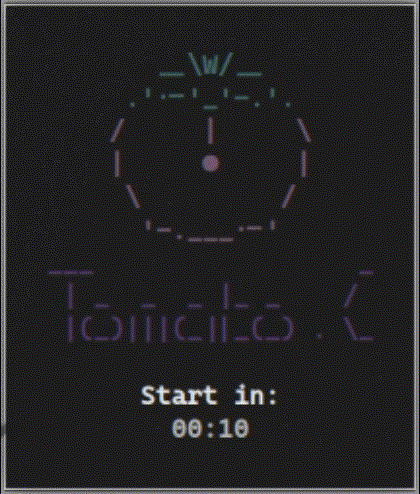
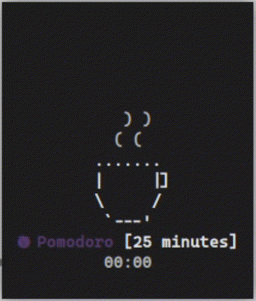
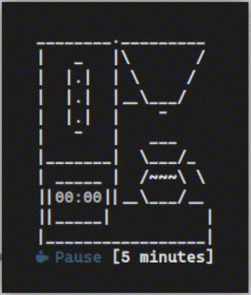

<h1 align="center">
    <br>
    
    
    
    
    <br>
    Tomato.C
    <br>
</h1>

<h4 align="center">A pomodoro timer written in pure <a href="https://www.open-std.org/JTC1/SC22/WG14/www/standards" target="_blank">C</a>.</h4>

<p align="center">
<a href="./LICENSE"></a>
<a href="https://www.buymeacoffee.com/gabrielzschmitz" target="_blank"></a>
<a href="https://github.com/gabrielzschmitz/Tomato.C"></a>
</p>

<p align="center">
  <a href="#-how-to-install">How to Install</a> •
  <a href="#-how-to-use">How to Use</a> •
  <a href="#-the-pomodoro-method">The Pomodoro Method</a> •
  <a href="#-todo">Todo</a> •
  <a href="#-dependencie">Dependencie</a> •
  <a href="#-license">License</a>
</p>

## 💾 How to Install
<b>Note</b>: a good practice is to clone the repo at <i>$HOME/.local/src/</i>.
```
$ git clone https://github.com/gabrielzschmitz/Tomato.C.git
$ cd Tomato.C
$ sudo make
```

## 🚀 How to Use
```
$ tomatoc
```

To run it at the best terminal resolution use [setsid](https://man7.org/linux/man-pages/man1/setsid.1.html) (the geometry depends on your font size):
```
$ setsid -f "$TERMINAL" -g 25x14 -c tomato -e tomato
```

## 🍅 The Pomodoro Method
It consists of using a timer to break down work into <b>intervals</b>, follow the <b>steps</b>:
<i>
 1. <b>First 3 rounds:</b>
    - <b>25</b> minutes of <b>focus</b>;
    - <b>5</b> minutes of <b>break</b>;
 2. <b>Final round:</b>
    - <b>25</b> minutes of <b>focus</b>;
    - <b>30</b> minutes of <b>break</b>;
 3. <b>Repeat.</b>
</i>

## 📝 Todo
- [X] Make a welcome screen
- [ ] Rewrite using ncurses
- [ ] Make it auto center (without setsid)

## ⚓ Dependencie
It only needs [gcc](https://gcc.gnu.org/) to compile.

## 📜 License
This software is licensed under the [GPL-3](./LICENSE) license.

