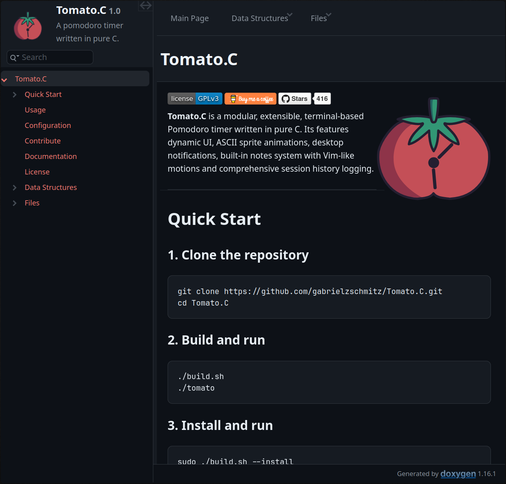

# Tomato.C


<a href="./LICENSE"></a>
<a href="https://www.buymeacoffee.com/gabrielzschmitz" target="_blank"></a>
<a href="https://github.com/gabrielzschmitz/Tomato.C"></a>

**Tomato.C** is a modular, extensible, terminal-based Pomodoro timer written in
pure C. Its features dynamic UI, ASCII sprite animations, desktop
notifications, built-in notes system with Vim-like motions and comprehensive
session history logging.

---

## Installation

Choose the installation method that best fits your needs. **Homebrew** is
recommended for macOS, the **install script** is the quickest option for
Linux and macOS, and **building from source** is ideal if you want to
customize or contribute to the project.

<details>
<summary>Quick install script</summary>

```bash
curl -sSL https://raw.githubusercontent.com/gabrielzschmitz/Tomato.C/main/install.sh | bash
```
</details>

<details>
<summary>Build from source</summary>

```bash
git clone https://github.com/gabrielzschmitz/Tomato.C.git
cd Tomato.C
./build.sh
```
</details>

---

## Usage

Pomodoro controls and navigation are handled via keyboard shortcuts and mouse
input. To get help with the keybinds press `?`/`F1` at anytime!

<p align="center">
  
</p>
<p align="center">
  <em>
  Tomato.C combines modern productivity features with a clean, retro-inspired
  terminal interface.
  </em>
</p>

---

## Configuration

Tomato.C uses a _toml_ configuration file. When installed via `install.sh`, a
fully commented sample config is automatically created at
`~/.config/tomato/config.toml`.

All available options are documented directly in the file, including timer
durations, status bar modules, notifications, animations, keybindings, and
other general settings.

---

## Documentation

Complete API and developer documentation is generated with **Doxygen**.

<p align="center">
  
</p>
<p align="center">
  <em>
  Doxygen-generated API documentation for Tomato.C.
  </em>
</p>

Generate the documentation locally:

```bash
cd docs
./generate.sh
$BROWSER output/html/index.html
```

---

## Contribute

Feel free to contribute to the project, the requirements are to follow
[Conventional Commits](https://www.conventionalcommits.org/en/v1.0.0), follow
[DOXYGEN](https://www.doxygen.nl/index.html) style of documenting code and use
`.clang-format` to format the files.

---

## License

This project is licensed under the GNU General Public License v3.0. See the
[LICENSE](./LICENSE) file for details.
