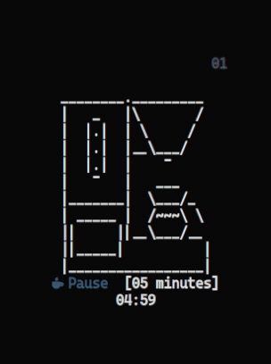

<h1 align="center">
    <br>
    
    
    
    
    <br>
    Tomato.C
    <br>
</h1>

<h4 align="center">A pomodoro timer written in pure <a href="https://www.open-std.org/JTC1/SC22/WG14/www/standards" target="_blank">C</a>.</h4>

<p align="center">
<a href="./LICENSE"></a>
<a href="https://www.buymeacoffee.com/gabrielzschmitz" target="_blank"></a>
<a href="https://github.com/gabrielzschmitz/Tomato.C"></a>
</p>

<p align="center">
  <a href="#-dependencies">Dependencies</a> •
  <a href="#-how-to-install">How to Install</a> •
  <a href="#-how-to-use">How to Use</a> •
  <a href="#%EF%B8%8F-controls-and-preferences">Controls and Preferences</a> •
  <a href="#-the-pomodoro-method">The Pomodoro Method</a> •
  <a href="#-to-do">To-do</a> •
  <a href="#-contribute">Contribute</a> •
  <a href="#-license">License</a>
</p>

## ⚓ Dependencies

It only needs [gcc](https://gcc.gnu.org/) to compile, [ncurses](https://invisible-island.net/ncurses/) as the graphic library and [pkg-config](https://github.com/freedesktop/pkg-config) to proper librarys linking. 
But optionally you can install [dunst](https://github.com/dunst-project/dunst)(or other notification daemon with notify-send support) to show notifications, [mpv](https://mpv.io/) for the notifications sounds and a [Nerd Font](https://www.nerdfonts.com/) for the icons:

```
ARCH LINUX
$ sudo pacman -S base-devel ncurses dunst mpv pkgconf
UBUNTU
$ sudo apt install build-essential libncurses5-dev libncursesw5-dev dunst mpv pkg-config
FEDORA
$ sudo dnf groupinstall 'Development Tools' && sudo dnf install ncurses-devel dunst mpv pkgconf
MACOS (MacPorts needed)
$ brew install gcc && sudo port install ncurses mpv
```

<b>Note</b>: if you're using <b>WSL</b>, install [wsl-notify-send](https://github.com/stuartleeks/wsl-notify-send) to get the notifications and then toggle it in the config.h. Saddly [mpv](https://mpv.io/) don't work at WSL, so there's not custom sounds.

## 💾 How to Install
<b>Note</b>: a good practice is to clone the repo at <i>$HOME/.local/src/</i>
```
$ git clone https://github.com/gabrielzschmitz/Tomato.C.git
$ cd Tomato.C
$ sudo make install

Using nix package manager:
$ git clone https://github.com/gabrielzschmitz/Tomato.C.git
$ cd Tomato.C
$ nix-build default.nix
```

## 🚀 How to Use

Just <b>type it</b> in the <b>terminal</b>:
```
$ tomato
```

<b>Tip:</b> For the best terminal resolution use [setsid](https://man7.org/linux/man-pages/man1/setsid.1.html) (the geometry depends on your font size):
```
$ setsid -f "$TERMINAL" -g 33x21 -c tomato -e tomato
```

## 🕹️ Controls and Preferences


Use the following <b>keys</b> to <b>control</b> the application:

 * <b><i>Arrows or VIM Keys:</i></b> To move and select;
 * <b><i>ENTER:</i></b> To select;
 * <b><i>CTRL+X:</i></b> To return to the main menu wherever you are;
 * <b><i>P or CTRL+P:</i></b> To toggle pause;
 * <b><i>ESC or Q:</i></b> To quit.

You can configure the following settings:

 * <b><i>Pomodoros Amount</i></b>;
 * <b><i>Work Time</i></b>;
 * <b><i>Short Pause Time</i></b>;
 * <b><i>Long Pause Time</i></b>.

<b>Note</b>: Edit the config.h to your preference, then `sudo make install` again to take effect.

## 🍅 The Pomodoro Method


The technique basically consists of using a timer to break down work into <b>intervals</b>, follow the <b>steps</b>:

 1. Get a <b>to-do list</b>;

 2. Start [Tomato.C](https://github.com/gabrielzschmitz/Tomato.C) and focus on a <b>single task for 25 minutes</b> straight until notification pops up;

 3. Then <b>record what you completed</b> and enjoy a <b>5 minutes break</b>;

 4. After <b>4 pomodoros</b> (steps 2 and 3), take a longer, <b>30 minutes break</b>;

 5. <b>Restart</b>.

<b>Note</b>: the <b>timers</b> and the <b>amount of pomodoros can be changed</b> by the user.
## 📝 To-do
- [X] Make a welcome screen
- [X] Rewrite using ncurses
- [X] Implement input controls
- [X] Implement user options
- [X] Make it auto center
- [X] Add a notification sound
- [ ] Implement save current state
- [ ] Implement mouse support
- [ ] Implement simple note taking (maybe using a nvim instance)

## 🤝 Contribute
Feel free to contribute to the project, the only requirement is to follow the commit tittle pattern:

 * File-Related-Emoji Tittle

## 📜 License
This software is licensed under the [GPL-3](./LICENSE) license.

